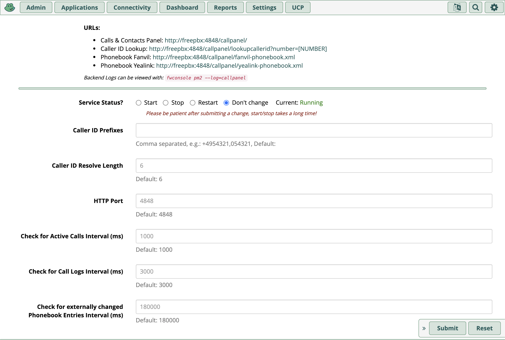

# FreePBX Realtime Calls & Contacts Panel

This is a module for FreePBX.
It is a realtime panel to view and manage calls and contacts.

Suited for use at Home and Small Businesses.

Compatible and tested on FreePBX version: **16.0.x**

Written in NodeJS, React and PHP (only glue).

## Features

* **Realtime Call Monitoring**
  * View Active Calls (Incoming/Outgoing)
  * View Call Logs
* **Better CallerID Lookup**
  * CallerID for Incoming and Outgoing Calls
  * Integrates with CallerID Lookup Module 
    * Custom Lookup Rest Endpoint
    * Can match Numbers with and without custom area codes
* **Better Contact Management**
  * Integrates with FreePBX ContactManager
  * Create/Update/Delete Contacts with beautiful UI
  * Save unknown Numbers from Call Logs directly as new Contacts
  * Add unknown Numbers from Calls Logs directly to already existing Contacts (via a Search feature)
* **Start Calls directly from the browser from any extension (or ring group) to any number**
* **Beautiful UI (React + NodeJS)**
* **Multi-Language Support**
  * supported Languages (yet): English 🇺🇸🇬🇧, German (Deutsch) 🇩🇪 
  * new languages can be added easily
* **Automatic Phonebook Generation**
  * generates IP phone compatible phonebooks (including multiple saved phone numbers per contact)
  * supported manufacturers (yet): yealink, fanvil 
* **FreePBX Module Wrapper**
  * Easy install via FreePBX Module Admin
  * Uses PM2 Module to run the backend service
  * Administration View in FreePBX to configure the panel


## Screenshots


# Install

1. Go to FreePBX -> Admin -> Module Admin -> Upload Modules
2. Upload the latest version of the module (tar.gz)
   1. link to latest version: https://github.com/adroste/freepbx-realtime-calls-contacts-panel/archive/main.tar.gz
3. Install it and reload FreePBX (Apply Config)
4. Go to FreePBX -> Admin -> Calls + Contacts Panel




## Advanced Usage

* Phonebook URLs:
  * Fanvil: http://myfreepbx:4848/callpanel/fanvil-phonebook.xml
  * Yealink: http://myfreepbx:4848/callpanel/yealink-phonebook.xml
* Caller ID Lookup:
  * You can add custom area codes to the configuration to improve lookup of numbers. 
    * Go to FreePBX -> Admin -> Calls + Contacts Panel -> Caller ID Prefixes and add your area codes like "+491234,01234".
    * E.g. if you saved a number without the area code and the incoming caller id includes it, it will match and if you saved a number with area code and the incoming caller id does not include it, it will also match.
  * Create a CallerID Lookup Source like:


---
---

# Development hints

## Project structure

```
.                                  --- FreePBX Module Wrapper (Root Dir + Files)
├── Callpanel.class.php
├── LICENSE
├── README.md
├── calls-contacts-panel        --- Backend / Service (The Real App)
│   ├── LICENSE
│   ├── build
│   ├── config.default.json
│   ├── config.dev.json
│   ├── config.local.json
│   ├── dev-resources
│   ├── frontend               --- Frontend (React Panel)
│   ├── jest.config.js        
│   ├── node_modules          
│   ├── package-lock.json     
│   ├── package.json          
│   ├── src                   
│   ├── tsconfig.eslint.json  
│   └── tsconfig.json         
├── install.php
├── module.xml
├── page.callpanel.php
├── uninstall.php
└── views
    └── main.php
```

## Adding a Language

* Go to `calls-contacts-panel/frontend/public/locales`
* Create a new folder with the desired language tag, e.g. `de`, `en`, `fr` etc.
* Copy the `en/translation.json` to the new folder and translate the values
* Rebuild the app and test the translation.
* Make a pull request so that I can add the language to this repo.

## Dev Environment

### Backend

* Forward ports 3306 (MySQL) and 5038 (AMI: Asterisk Manager Interface) to your dev machine, e.g. using ssh:
```bash
ssh -L 3306:127.0.0.1:3306 \
  -L 5038:127.0.0.1:5038 \
  root@yourFreePBXInstance
```
* Open the `calls-contacts-panel` folder as workspace in VS Code.
* Create a `dev-resources` folder and copy the files `/etc/freepbx.conf` and `/etc/asterisk/manager.conf` from your FreePBX instance into it.
* Install deps with `npm install`
* Start service via `npm run dev:service` (ts-node), alternatively you can use `npm run build:watch` and `npm run dev:service:build`
  
### Frontend

* Open the `calls-contacts-panel/frontend` folder as workspace in VS Code.
* Install deps with `npm install`
* Start react-scripts with `npm run start`